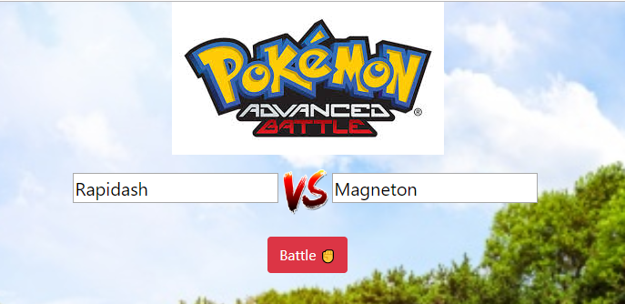
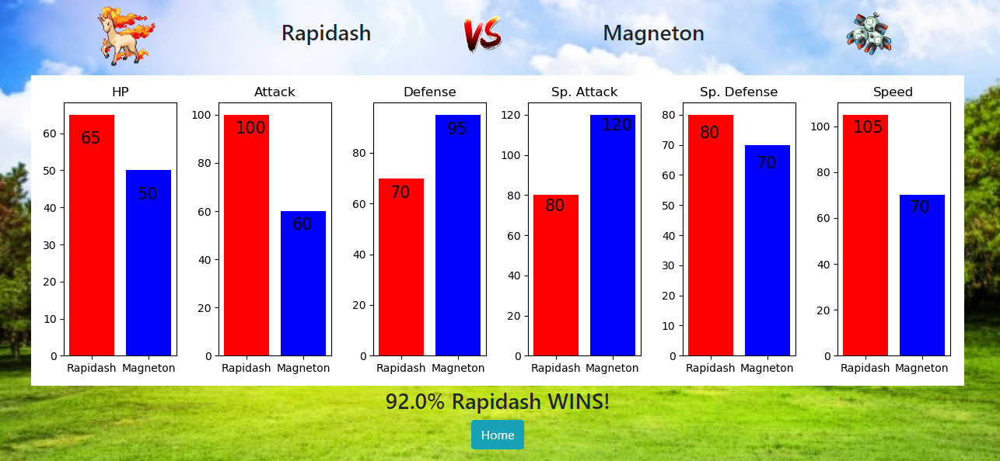
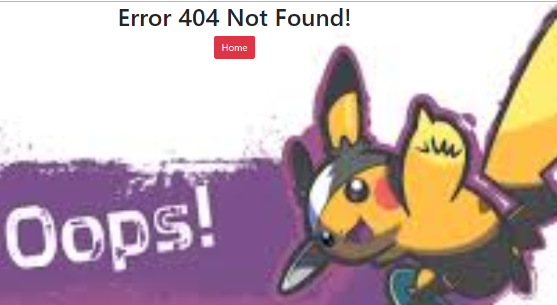

Repositori ini berisi pengerjaan untuk soal [ujian machine learning JCDS04](https://github.com/LintangWisesa/Ujian_MachineLearning_JCDS04) nomor 3.

Hasilnya ada sebuah aplikasi web sederhana dimana pada halaman depan pengguna dapat memasukan dua nama Pokemon.

 

Di dalam aplikasi ini terdapat sebuah model machine learning yang akan memprediksi hasil pertandingan kedua pokemon tersebut. [Dataset](./Datasets) yang digunakan adalah dataset pokemon battle yang berasal dari [kaggle.com](https://www.kaggle.com/sekarmg/pokemon). Langkah-langkah untuk membuat model machine learning dapat dilihat pada file [model_prep.py](model_prep.py).

Setelah kedua nama pokemon dimasukkan, bila pengguna mengklik tombol *battle* maka pengguna akan diarahkan ke laman yang berisi perbandingan status kedua pokemon beserta persentase hasil pertandingan.

Langkah-langkah untuk membuat grafik tersebut terdapat dalam file [graph.py](graph.py)

Gambar pokemon didapatkan dari [Poke API](https://pokeapi.co/)

Bila nama pokemon tidak ada di dalam API atau dataset atau pengguna masuk ke route yang tidak ada, maka pengguna akan diarahkan ke laman error.

Jalankan aplikasi ini di localhost anda dengan menjalankan file [app.py](app.py).

Selamat menikmati.

Informasi lebih lanjut dapat menghubungi saya melalui [linkedin](http://bit.ly/linkedinNRR).